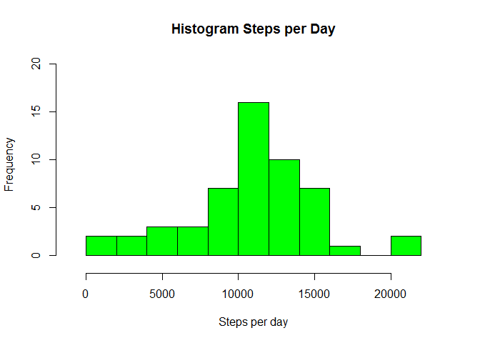
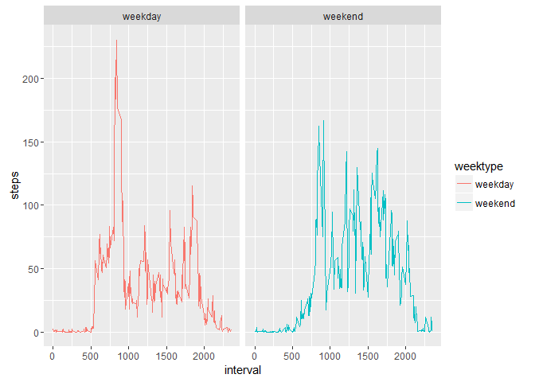

# Reproducible Research: Project Assignment 1
Alessandro Spilotros  
10 gennaio 2016  
Abstract
--------------
This document presents the results from Project Assignment 1 in the Coursera course Reproducible Research. It was generated using R Markdown and generating a HTML file as output.

For the assignment we use data from a personal activity monitoring device which collects data at 5 minute intervals during the day. The data cover two months of activity of an anonymous individual and include the number of steps taken in 5 minute intervals per day.

Loading packages
---------------------------

```r
library(dplyr)
```

```
## 
## Attaching package: 'dplyr'
```

```
## The following objects are masked from 'package:stats':
## 
##     filter, lag
```

```
## The following objects are masked from 'package:base':
## 
##     intersect, setdiff, setequal, union
```

```r
library(lubridate)
library(ggplot2)
```

```
## Warning: package 'ggplot2' was built under R version 3.2.3
```
Loading and tyding the data
---------------------------

```r
data <- read.csv("activity.csv", header = TRUE, sep = ',')
```
Using lubridate package to convert the date into a date format in R

```r
data$date <- ymd(data$date)
head(data)
```

```
##   steps       date interval
## 1    NA 2012-10-01        0
## 2    NA 2012-10-01        5
## 3    NA 2012-10-01       10
## 4    NA 2012-10-01       15
## 5    NA 2012-10-01       20
## 6    NA 2012-10-01       25
```
What is mean total number of steps taken per day?
---------------------------------------------------
For this part of the assignment, you can ignore the missing values in the dataset.

1. Calculate the total number of steps taken per day
2. If you do not understand the difference between a histogram and a barplot, research the difference between them. Make a histogram of the total number of steps taken each day
3. Calculate and report the mean and median of the total number of steps taken per day

Part 1.

```r
StepsPerDay <- data %>%
  filter(!is.na(steps)) %>%
  group_by(date) %>%
  summarize(steps = sum(steps))
head(StepsPerDay)
```

```
## Source: local data frame [6 x 2]
## 
##         date steps
##       (time) (int)
## 1 2012-10-02   126
## 2 2012-10-03 11352
## 3 2012-10-04 12116
## 4 2012-10-05 13294
## 5 2012-10-06 15420
## 6 2012-10-07 11015
```
Part 2.

```r
hist(StepsPerDay$steps, 15, xlim =c(-1000,23000), ylim=c(-1,20), xlab = "Steps per day", ylab = "Frequency", main = "Histogram Steps per Day", col = 'green')
```

\
Part 3.

```r
mean_steps <- mean(StepsPerDay$steps, na.rm = TRUE)
median_steps <- median(StepsPerDay$steps, na.rm = TRUE)
print("mean steps=")
```

```
## [1] "mean steps="
```

```r
mean_steps
```

```
## [1] 10766.19
```

```r
print("median steps=")
```

```
## [1] "median steps="
```

```r
median_steps
```

```
## [1] 10765
```

What is the average daily activity pattern?
-------------------------------------------------
1. Make a time series plot (i.e. type = "l") of the 5-minute interval (x-axis) and the average number of steps taken, averaged across all days (y-axis)
2. Which 5-minute interval, on average across all the days in the dataset, contains the maximum number of steps?

Part 1. 

```r
Interval <- data %>%
  filter(!is.na(steps)) %>%
  group_by(interval) %>%
  summarize(steps = mean(steps))
head(Interval)
```

```
## Source: local data frame [6 x 2]
## 
##   interval     steps
##      (int)     (dbl)
## 1        0 1.7169811
## 2        5 0.3396226
## 3       10 0.1320755
## 4       15 0.1509434
## 5       20 0.0754717
## 6       25 2.0943396
```
Part 2.

```r
plot(Interval$interval,Interval$steps,type = 'l', xlab = 'interval', ylab='steps', col='red')
```

\
which.max function finds the maximum steps on average across all days

```r
Interval[which.max(Interval$steps),]
```

```
## Source: local data frame [1 x 2]
## 
##   interval    steps
##      (int)    (dbl)
## 1      835 206.1698
```
The interval found is 835 with 206 steps.

Imputing missing values
-------------------------------------------------------------
Note that there are a number of days/intervals where there are missing values (coded as NA). The presence of missing days may introduce bias into some calculations or summaries of the data.

1. Calculate and report the total number of missing values in the dataset (i.e. the total number of rows with NAs).
2. Devise a strategy for filling in all of the missing values in the dataset. The strategy does not need to be sophisticated. For example, you could use the mean/median for that day, or the mean for that 5-minute interval, etc.
3. Create a new dataset that is equal to the original dataset but with the missing data filled in.
4. Make a histogram of the total number of steps taken each day and calculate and report the mean and median total number of steps taken per day. Do these values differ from the estimates from the first part of the assignment? What is the impact of imputing missing data on the estimates of the total daily number of steps?

Part 1.
finding the total number of missing values

```r
sum(is.na(data$steps))
```

```
## [1] 2304
```
Part 2-3.
Strategy to fill in the missing values=replacing with the average over the 5 min interval.

```r
data2 <- data
missing <- is.na(data2$steps)
interval_avg <- tapply(data2$steps, data2$interval, mean, na.rm=TRUE, simplify=TRUE)
data2$steps[missing] <- interval_avg[as.character(data2$interval[missing])]
sum(is.na(data2$steps))
```

```
## [1] 0
```
Part 4.
Calculating the number of steps taken in each 5-minute interval per day

```r
steps2 <- data2 %>%
  group_by(date) %>%
  summarize(steps = sum(steps))
head(steps2)
```

```
## Source: local data frame [6 x 2]
## 
##         date    steps
##       (time)    (dbl)
## 1 2012-10-01 10766.19
## 2 2012-10-02   126.00
## 3 2012-10-03 11352.00
## 4 2012-10-04 12116.00
## 5 2012-10-05 13294.00
## 6 2012-10-06 15420.00
```
Plotting the new histogram

```r
hist(steps2$steps, 15, xlim =c(-1000,23000), ylim=c(-1,25), xlab = "Steps per day", ylab = "Frequency", main = "Histogram Steps per Day (including missing values)", col = 'green')
```

\
Calculate the mean and median steps with the filled in values:

```r
mean_steps_2 <- mean(steps2$steps, na.rm = TRUE)
median_steps_2 <- median(steps2$steps, na.rm = TRUE)
mean_steps_2
```

```
## [1] 10766.19
```

```r
median_steps_2
```

```
## [1] 10766.19
```

Including the missing values the median and the mean are now both equal to 10766.19

Are there differences in activity patterns between weekdays and weekends?
---------------------------------------------------------------------------
For this part the weekdays() will come handy. Use the dataset with the filled-in missing values for this part.

1. Create a new factor variable in the dataset with two levels - "weekday" and "weekend" indicating whether a given date is a weekday or weekend day.
2. Make a panel plot containing a time series plot (i.e. type = "l") of the 5-minute interval (x-axis) and the average number of steps taken, averaged across all weekday days or weekend days (y-axis).

1. Using the function mutate of dplyr package it is possible to create the factor weektype

```r
weekendtest<-(weekdays(as.Date(data2$date))=="domenica"|weekdays(as.Date( data2$date))=="sabato")
weektest<-(weekdays(as.Date(data2$date))!="domenica"&& weekdays(as.Date(data2$date))!="sabato")
data2$weektype[weektest]<-"weekday"
data2$weektype[weekendtest]<-"weekend"
data2$weektype<-as.factor(data2$weektype)
str(data2$weektype)
```

```
##  Factor w/ 2 levels "weekday","weekend": 1 1 1 1 1 1 1 1 1 1 ...
```

```r
table(data2$weektype)
```

```
## 
## weekday weekend 
##   12960    4608
```

```r
data2 <- mutate(data2, weektype)
#data2$weektype <- as.factor(data2$weektype)
head(data2)
```

```
##       steps       date interval weektype
## 1 1.7169811 2012-10-01        0  weekday
## 2 0.3396226 2012-10-01        5  weekday
## 3 0.1320755 2012-10-01       10  weekday
## 4 0.1509434 2012-10-01       15  weekday
## 5 0.0754717 2012-10-01       20  weekday
## 6 2.0943396 2012-10-01       25  weekday
```
2. Calculating and plotting the average steps in the 5-minute interval and use ggplot for making the time series of the 5-minute interval for weekday and weekend

```r
interval2 <- data2 %>%
  group_by(interval, weektype) %>%
  summarise(steps = mean(steps))

p <- ggplot(interval2, aes(x=interval, y=steps, color = weektype)) + geom_line()+facet_wrap(~ weektype, ncol = 2, nrow=1)
print(p)
```

\
